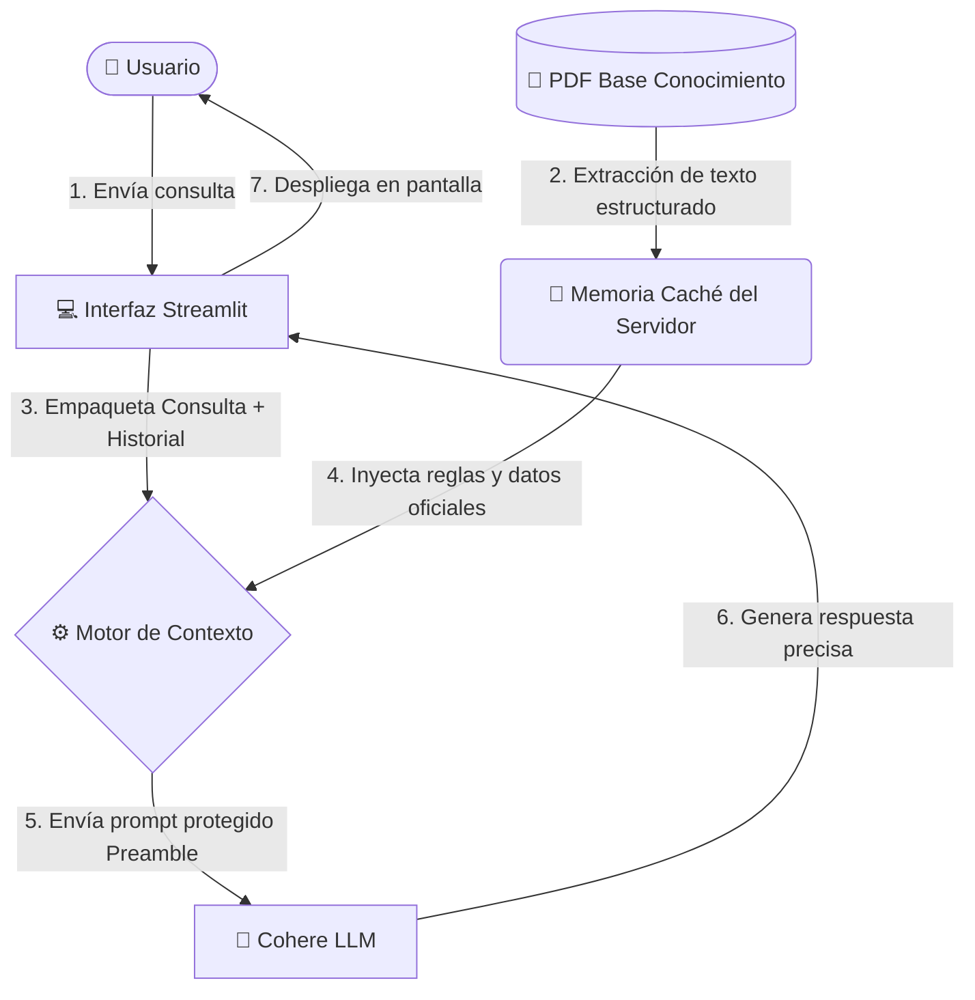

# ☕ Challenge Alura - Agente Inteligente 'Café Estelar'

<p align="center">
  
  
  
</p>

---

## 📝 Índice
1. [Descripción del Proyecto](#-descripción-del-proyecto)
2. [Características Principales](#-características-principales)
3. [Tecnologías Utilizadas](#-tecnologías-utilizadas)
4. [Arquitectura y Flujo de Datos](#-arquitectura-y-flujo-de-datos)
5. [Instalación y Configuración Local](#-instalación-y-configuración-local)
6. [Casos de Uso e Interacción](#-casos-de-uso-e-interacción)
7. [Despliegue y Acceso Público](#-despliegue-y-acceso-público)
8. [Autor](#-autor)

---

## 📄 Descripción del Proyecto

Este proyecto consiste en el desarrollo e implementación de un **Agente de Inteligencia Artificial** enfocado en la atención al cliente automatizada para la cafetería **Café Estelar**. La solución resuelve consultas en tiempo real sobre el menú, los precios, los horarios de atención y las políticas del establecimiento de forma interactiva y amigable.

Para evitar el fenómeno de "alucinación" (respuestas inventadas por el modelo de lenguaje), el agente fue construido bajo la arquitectura **RAG (Retrieval-Augmented Generation)**, limitando estrictamente su conocimiento a los datos oficiales contenidos en el documento corporativo `informacion_cafeteria.pdf`.

---

## ⚡ Características Principales

*   🧠 **Respuestas con Contexto Cerrado:** Filtro estricto que impide al agente responder preguntas que no pertenezcan al ecosistema o al menú de la cafetería.
*   💬 **Persistencia de Memoria:** Interfaz con capacidad para recordar el hilo de la conversación actual gracias al manejo de estados de sesión.
*   ⚡ **Optimización de Carga:** Uso de caché a nivel de servidor para evitar lecturas repetitivas del archivo PDF, acelerando el tiempo de respuesta.
*   🔒 **Seguridad de Credenciales:** Implementación avanzada de gestión de secretos (*Streamlit Secrets*) para proteger las llaves de API (API Keys) de accesos no autorizados en el código fuente.

---

## 🛠️ Tecnologías Utilizadas

El proyecto fue desarrollado utilizando herramientas modernas del ecosistema de Ciencia de Datos e Inteligencia Artificial:

*   **Lenguaje:**  (v3.9 o superior)
*   **Orquestador de Interfaz:** 
*   **Modelo de Lenguaje (LLM):**  (`command-r-08-2024`)
*   **Procesamiento de PDF:** `PyPDF` (Extracción y parsing de texto eficiente)

---

## 📐 Arquitectura y Flujo de Datos

El procesamiento de las consultas sigue un flujo controlado y estructurado desde que el usuario escribe un mensaje hasta que el modelo genera la respuesta:



---

## 🚀 Instalación y Configuración Local

Sigue estos pasos para clonar el repositorio y ejecutar el agente inteligente en tu entorno local:

### Prerrequisitos
Asegúrate de contar con Python instalado y una clave de API de Cohere.

### 1. Clonar el repositorio
```bash
git clone [https://github.com/Jeison9013/alura-agente-cafe-estelar.git](https://github.com/Jeison9013/alura-agente-cafe-estelar.git)
cd alura-agente-cafe-estelar
```

### 2. Instalar dependencias
Se recomienda el uso de un entorno virtual para mantener limpias tus librerías:
```bash
pip install -r requirements.txt
```

### 3. Configurar variables ocultas (Secrets)
Crea un directorio llamado `.streamlit` en la raíz del proyecto y añade el archivo `secrets.toml`:
```toml
# .streamlit/secrets.toml
COHERE_API_KEY = "TU_API_KEY_REAL_DE_COHERE"
```

### 4. Ejecutar la aplicación
```bash
streamlit run app.py
```

---

## 💬 Casos de Uso e Interacción

El agente ha sido validado exitosamente bajo múltiples escenarios de prueba:

### Ejemplo 1: Consulta Existente (Éxito de Recuperación)
> **Usuario:** ¿Tienen internet y cuál es la contraseña?
> **Agente:** ¡Sí! En Café Estelar ofrecemos conexión WiFi de alta velocidad. La contraseña de la red principal es `cafe_y_codigo_2026`.

### Ejemplo 2: Consulta Fuera de Contexto (Filtro Anti-Alucinación)
> **Usuario:** ¿Hacen entregas a domicilio usando drones o helicópteros?
> **Agente:** No cuento con esa información en los registros oficiales de Café Estelar.

---

## 🌐 Despliegue y Acceso Público

El agente inteligente se encuentra completamente operativo en la nube y listo para su evaluación.

🔗 **Enlace de acceso a la Aplicación Web:** [https://alura-agente-cafe-estelar-raxi2xgxgxows4tdlj2s33.streamlit.app/](https://alura-agente-cafe-estelar-raxi2xgxgxows4tdlj2s33.streamlit.app/)
---

## 👤 Autor

* **Jeison Rodríguez Flores** - *Desarrollador del Proyecto* - [Jeison9013](https://github.com/Jeison9013)

---
Este proyecto fue desarrollado con fines educativos como parte del Challenge de Inteligencia Artificial del programa **Oracle Next Education**.
